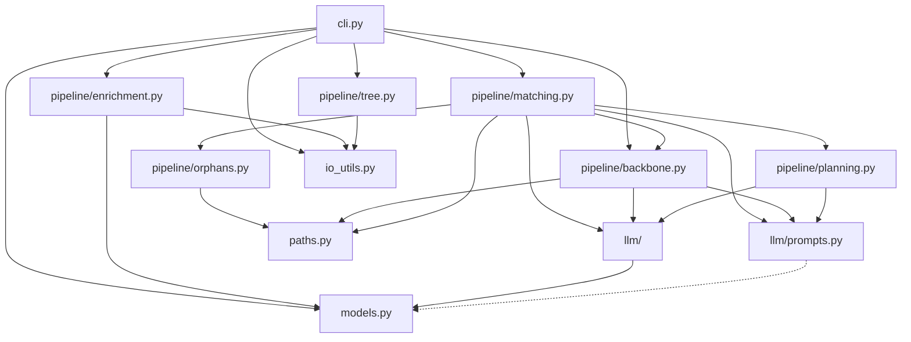

# REFACTORING ANALYSIS REPORT
**Generated**: 01-05-2026 12:00:00
**Target File(s)**: `rag/file_rearrangement/rearrange/file_rearrang.py` (1894 lines)
**Analyst**: Claude Refactoring Specialist
**Report ID**: refactor_file_rearrang_01-05-2026_120000

> ⚠️ Analysis only. No source code, tests, or configuration were modified by this report.

---

## EXECUTIVE SUMMARY

`file_rearrang.py` is a 1894-line monolith that orchestrates a 4-stage LLM-driven course-material reorganization pipeline (enrich → backbone → match → tree). It mixes Pydantic models, path/IO helpers, LLM prompt construction, tree traversal, plan generation, and CLI orchestration in one module.

**Refactoring drivers**:
1. Single file > 3.5x the 500-line guideline.
2. `generate_rearrangement_plan` (~165 lines) and `run_plan_matching` (~125 lines) carry multiple responsibilities each.
3. Prompt templates are inlined in code, making them hard to version, diff, and test.
4. Cross-cutting helpers (paths, IO, LLM gateway) are interleaved with domain logic.
5. Dead/commented-out code (`run_aggregation_analysis`, alternate prompts) bloats the file.
6. Pipeline contract between steps relies on filename conventions and side effects (debug logs as artifacts), which has already produced a real bug (the `06_rearrangement_plan.json` mismatch fixed earlier this session).

**Recommended approach**: **Single-file → package split** into ~10 focused modules under a `rearrange/` package. No behavior change. Estimated 4–5 working days including a baseline test harness.

---

## CODEBASE-WIDE CONTEXT

### Related Files Discovery
- **Target file imported by**: 0 files. `file_rearrang.py` is invoked directly via `python file_rearrang.py`. There is one near-duplicate sibling (`file_rearrang copy.py`) preserved as a reference; it is **not** imported and should be deleted or moved into `archive/` as part of cleanup.
- **Target file imports**: stdlib (`os`, `json`, `sqlite3`, `re`, `argparse`, `sys`, `contextvars`, `dataclasses`, `typing`), third-party (`openai`, `pydantic`, `dotenv`).
- **Tightly coupled modules**: none — the refactor target is self-contained, which makes it a low-risk candidate.
- **Circular dependencies detected**: No.

### Additional Refactoring Candidates (sibling files)
| Priority | File | Lines | Reason | Relationship |
|---|---|---|---|---|
| LOW | `folder_to_Json.py` | (sibling) | Produces input JSON consumed by target | Upstream of pipeline, separate concern |
| LOW | `deep_reorg.py` | (sibling) | Likely related orchestration | Possibly overlapping logic — audit later |
| CLEANUP | `file_rearrang copy.py` | ~1500 | Stale duplicate | Should be removed or archived |

### Recommended Approach
- **Strategy**: **Single-file → package** (target only).
- **Rationale**: zero external importers, no public API to preserve, low coordination cost. Sibling files can be addressed independently.

---

## CURRENT STATE ANALYSIS

### File Metrics Summary
| Metric | Value | Target | Status |
|---|---|---|---|
| Total lines | 1894 | <500 per module | ❌ |
| Top-level functions | ~50 | <20 per module | ❌ |
| Pydantic models | 9 | n/a | ✅ |
| Dataclasses | 3 | n/a | ✅ |
| Classes | 1 (`LLMGateway`) | <10 | ✅ |
| Largest function | `generate_rearrangement_plan` (~165 LOC) | <60 | ❌ |
| Module-level imports | 9 | n/a | ✅ |
| Commented-out blocks | 3 large (40+, 50+, 30 lines) | 0 | ❌ |

### Code Smell Analysis
| Code smell | Count | Severity | Examples |
|---|---|---|---|
| Long function | 4 | HIGH | `generate_rearrangement_plan` (~165), `run_plan_matching` (~125), `build_rearranged_structure_tree` (~50), `enrich_structure_with_descriptions` (~95) |
| Mixed responsibilities in module | — | CRITICAL | Models + IO + LLM + domain + CLI in one file |
| Inline prompt templates | 5 | MEDIUM | `_build_matching_system_prompt`, backbone prompt in `run_backbone_identification`, misc-refinement prompt in `LLMGateway`, two large commented prompts |
| Dead/commented code | 3 blocks | MEDIUM | `run_aggregation_analysis` (lines ~593–645), groups_completion (~1269–1294), commented config in matching prompt |
| Side-effect persistence | 2 | HIGH | Plans are persisted only via `save_debug_log` calls inside business functions (caused the `06_*` filename bug) |
| Magic strings | many | LOW | `"Lecture Miscellaneous"`, `"study"`, `"practice"`, `"__NAME__"` prefix, `"06_pre_refinement_plan"` etc. |
| `print` for logging | ~25 | MEDIUM | No structured logging; mix of `print` / `_safe_print` |
| Bare `except Exception` | 4 | MEDIUM | `_configure_stdout`, `_console_safe`, batch loop in `run_plan_matching`, misc-refinement, `execute_pipeline_steps` |
| Optional union typing inconsistency | — | LOW | Mix of `Dict | None`, `Optional[Dict]` (PEP 604 + typing both used) |

### Test Coverage Analysis
| File/Module | Coverage | Notes |
|---|---|---|
| `file_rearrang.py` | **0% (no tests detected)** | A `test/` directory exists at the rearrange root — confirm whether it contains tests for this module. If not, that is the largest single risk. |

> **Coverage gap is the dominant risk.** Refactoring should not begin without a behavioral baseline.

### Complexity Hotspots (visual estimate)
| Function/Class | Lines | Cyclomatic (est.) | Cognitive (est.) | Params | Nesting | Risk |
|---|---|---|---|---|---|---|
| `generate_rearrangement_plan` | ~165 | ~22 | HIGH | 3 | 4 | **CRITICAL** |
| `run_plan_matching` | ~125 | ~15 | HIGH | 4 | 3 | **CRITICAL** |
| `enrich_structure_with_descriptions` (incl. closures) | ~95 | ~14 | MEDIUM | 4 | 3 | HIGH |
| `_build_matching_system_prompt` | ~50 | 2 | LOW | 2 | 1 | LOW (but long string) |
| `build_rearranged_structure_tree` | ~50 | ~6 | MEDIUM | 4 | 2 | MEDIUM |
| `_filter_matches` | ~30 | ~6 | MEDIUM | 2 | 3 | MEDIUM |
| `LLMGateway.refine_miscellaneous_groups` | ~22 | 1 | LOW | 2 | 1 | LOW |
| `collect_orphan_items` (with helpers) | ~55 (combined) | ~10 | MEDIUM | 3 | 4 | MEDIUM |

### Dependency Analysis (intra-file)
- `run_pipeline_cli` → `execute_pipeline_steps` → {`run_enrichment`, `run_backbone_identification`, `run_plan_matching`}
- `run_plan_matching` → {`extract_backbone_subtree`, `_make_backbone_groups`, `collect_orphan_items`, `_build_matching_system_prompt`, `_filter_matches`, `_append_unmatched_orphans_to_misc`, `generate_rearrangement_plan`, `LLMGateway`}
- `generate_rearrangement_plan` → `LLMGateway.refine_miscellaneous_groups`, `save_debug_log`
- `run_tree_step` → `build_rearranged_structure_tree` → {`load_json_file`, `load_file_hashes`, `index_enriched_data`, `_build_group_node`, `build_node_recursive`}

No cycles. Clear top-down call graph; this maps cleanly to a package decomposition.

### Performance Baselines (to capture before refactor)
| Metric | How to capture |
|---|---|
| End-to-end runtime per step | `time python file_rearrang.py --step all --course cs61a` |
| LLM call count and token usage | Wrap `LLMGateway` and log per-call metadata |
| Memory peak | `tracemalloc` around `enrich_structure_with_descriptions` and `run_plan_matching` |
| Output JSON byte sizes | Compare `outputs/<course>/*.json` before/after |
| Debug log determinism | Diff `logs/<course>/*.json` across runs (seed=42 should make these stable) |

---

## TARGET ARCHITECTURE

### Proposed package layout

```
rearrange/
├── __init__.py
├── __main__.py                   # python -m rearrange
├── models.py                     # All Pydantic models + PipelineContext, _EnrichmentStats
├── io_utils.py                   # load_json_file, save_debug_log, log-dir contextvar,
│                                 # _configure_stdout, _safe_print, _console_safe
├── paths.py                      # _normalize_path, _is_under_path, _chunked
├── llm/
│   ├── __init__.py               # LLMGateway, _llm_parse
│   └── prompts.py                # All system-prompt builders (matching, backbone, misc)
├── pipeline/
│   ├── __init__.py
│   ├── enrichment.py             # enrich_structure_with_descriptions + _enrich_* helpers
│   ├── backbone.py               # run_backbone_identification, extract_backbone_subtree,
│   │                             # _make_backbone_groups, extract_file_descriptions
│   ├── orphans.py                # collect_orphan_items, aggregate_folder_descriptions,
│   │                             # get_folder_candidates, _orphan_* helpers
│   ├── matching.py               # run_plan_matching, _filter_matches,
│   │                             # _append_unmatched_orphans_to_misc, build_summary
│   ├── planning.py               # generate_rearrangement_plan, merge_matches_into_groups
│   └── tree.py                   # build_rearranged_structure_tree, build_node_recursive,
│                                 # index_enriched_data, load_file_hashes,
│                                 # _detect_course_prefix, _build_group_node
└── cli.py                        # build_arg_parser, parse_cli_args, _build_context,
                                  # _derive_course_name, _resolve_db_path,
                                  # run_pipeline_cli, execute_pipeline_steps, run_tree_step
```

### Why this split
- **Single Responsibility**: each module covers one pipeline phase or one cross-cutting concern.
- **Testability**: pure functions (paths, models, planning) become trivially unit-testable; LLM calls are isolated behind `LLMGateway`, which can be substituted with a fake.
- **Prompt management**: separating `prompts.py` lets prompts be diffed and versioned without touching control flow.
- **Stable contracts**: `pipeline/*` modules define explicit return types; the previously implicit "debug log file is the artifact" anti-pattern is removed.

### Target file sizes (estimates)
| Module | Est. LOC |
|---|---|
| `models.py` | ~90 |
| `io_utils.py` | ~70 |
| `paths.py` | ~30 |
| `llm/__init__.py` | ~70 |
| `llm/prompts.py` | ~120 |
| `pipeline/enrichment.py` | ~180 |
| `pipeline/backbone.py` | ~100 |
| `pipeline/orphans.py` | ~180 |
| `pipeline/matching.py` | ~160 |
| `pipeline/planning.py` | ~180 |
| `pipeline/tree.py` | ~180 |
| `cli.py` | ~150 |

All under the 500-line target.

---

## REFACTORING PLAN

### Phase 0 — Backup & branch (0.5 day)
1. `mkdir -p backup_temp/`
2. `cp file_rearrang.py backup_temp/file_rearrang_original_2026-05-01_120000.py`
3. Create branch `refactor/file_rearrang_split` from current `refactor`.
4. Confirm `archive/` is the right home for `file_rearrang copy.py`; move it.

### Phase 1 — Behavioral baseline (1 day)
> No refactor begins without this.

1. Run end-to-end pipeline on a known fixture (`cs61a`, `eecs106b`) and **commit the output JSON files plus a hash manifest** as golden snapshots under `test/golden/`.
2. Author a thin pytest harness:
   - **Pure-function tests**: `_normalize_path`, `_is_under_path`, `_chunked`, `_dedupe_items`, `_detect_course_prefix`, `_orphan_skip_backbone_subtree`, `_enrich_should_skip_file`.
   - **Tree-walk tests** with fixture JSON (no LLM): `extract_backbone_subtree`, `extract_file_descriptions`, `collect_orphan_items` against a hand-built tree.
   - **LLM-mocked tests**: substitute `LLMGateway` with a fake returning canned `BackboneResult` / `OrphanMatchResponse` / `MiscRefinementResponse`. Assert plan structure round-trips.
   - **Golden-output test**: run pipeline against fixture with mocked LLM; diff against committed golden JSONs.
3. Target ≥80% line coverage on `file_rearrang.py` before any extraction.

### Phase 2 — Mechanical extractions (low risk first) (1 day)
Each extraction is its own commit; tests must pass after each.

| # | Extract | From lines (approx) | To | Risk |
|---|---|---|---|---|
| 2.1 | Pydantic models + `PipelineContext` + `_EnrichmentStats` | 35–92, 273–276 | `models.py` | LOW |
| 2.2 | `_normalize_path`, `_is_under_path`, `_chunked` | 166–183 | `paths.py` | LOW |
| 2.3 | `load_json_file`, `save_debug_log`, log-dir contextvar, `_configure_stdout`, `_console_safe`, `_safe_print` | 18–29, 98–163 | `io_utils.py` | LOW |
| 2.4 | `_llm_parse`, `LLMGateway` | 185–253 | `llm/__init__.py` | LOW |
| 2.5 | Inline prompts (matching, backbone, misc) | 240–246, 910–960, 1221–1229 | `llm/prompts.py` | LOW |

After Phase 2, the original file shrinks to ~1100 lines and re-imports the extracted symbols. Run full test + golden-diff after each commit.

### Phase 3 — Domain modules (2 days)
| # | Extract | From | To | Risk |
|---|---|---|---|---|
| 3.1 | Enrichment helpers + `enrich_structure_with_descriptions` + `run_enrichment` | 279–471, 1635–1666 | `pipeline/enrichment.py` | MEDIUM |
| 3.2 | `extract_file_descriptions`, `extract_backbone_subtree`, `_make_backbone_groups`, `run_backbone_identification` | 474–500, 821–853, 880–907, 1204–1240 | `pipeline/backbone.py` | MEDIUM |
| 3.3 | Orphan collection + folder candidates + aggregation helpers | 507–773 | `pipeline/orphans.py` | MEDIUM |
| 3.4 | Matching + filter + unmatched fallback + `build_summary` | 776–818, 963–1030, 1247–1378 | `pipeline/matching.py` | HIGH (largest semantic move) |
| 3.5 | Plan generation + group merge | 856–877, 1033–1197 | `pipeline/planning.py` | HIGH (largest function) |
| 3.6 | Tree builder | 1394–1613 | `pipeline/tree.py` | MEDIUM |

### Phase 4 — CLI shell (0.5 day)
| # | Extract | From | To | Risk |
|---|---|---|---|---|
| 4.1 | `_derive_course_name`, `_resolve_db_path`, `_build_context`, arg parser, `run_pipeline_cli`, `execute_pipeline_steps`, `run_tree_step`, `_load_enriched`, `_test_orphan_collection`, `__main__` | 1620–end | `cli.py` + `__main__.py` | LOW |

### Phase 5 — Cleanup (0.5 day)
1. Delete commented-out blocks (`run_aggregation_analysis`, alternate `groups_completion`, alternate prompts) — they are preserved in git history and `backup_temp/`.
2. Replace `print` with `logging` in non-CLI modules; keep `print` only in `cli.py`.
3. Tighten `except Exception` — narrow to expected exceptions where possible (`json.JSONDecodeError`, `sqlite3.Error`, `openai`-specific errors).
4. Normalize typing: pick `Optional[X]` **or** `X | None` and apply consistently.
5. Replace string magic with module-level constants (`MISC_GROUP_NAME = "Lecture Miscellaneous"`, `NAME_INDEX_PREFIX = "__NAME__"`, etc.).
6. Decompose `generate_rearrangement_plan` into:
   - `_seed_plan_from_backbone(groups) -> dict`
   - `_distribute_matches(plan, matches)`
   - `_refine_miscellaneous(plan, gateway)`
   - `_finalize_plan(plan) -> list[dict]`

### Phase 6 — Verification (0.5 day)
1. Re-run golden-diff suite; bytes-identical output JSON required.
2. Re-run end-to-end on a held-out fixture not used in golden snapshots.
3. Profile: import time, peak memory, total wall-clock vs Phase 0 baseline.
4. Update `README.md` with the new `python -m rearrange ...` invocation.

---

## RISK ASSESSMENT

### Risk matrix
| Risk | Likelihood | Impact | Score | Mitigation |
|---|---|---|---|---|
| LLM non-determinism makes golden-diff flaky | HIGH | HIGH | 9 | Mock `LLMGateway` in tests; use seed=42 only for manual smoke |
| Subtle path-handling regression during orphans/matching split | MEDIUM | HIGH | 6 | Phase-1 unit tests for path helpers; tree-walk fixtures |
| `save_debug_log` log-dir contextvar lost in extraction | MEDIUM | MEDIUM | 4 | Re-bind in `cli.py` only; tests assert log files land under `logs/<course>/` |
| Hidden coupling via the `PipelineContext`/`args` blob | MEDIUM | MEDIUM | 4 | Pass typed `PipelineContext` only; do not propagate `argparse.Namespace` past `cli.py` |
| Stale `file_rearrang copy.py` resurrected by mistake | LOW | MEDIUM | 2 | Move to `archive/`; remove from `__pycache__`/imports |
| Sqlite description lookup heuristic changes (recent fix) | LOW | MEDIUM | 2 | Lock with a dedicated test fixture DB |

### Rollback plan
1. Refactor lives on `refactor/file_rearrang_split`; `main` is unchanged.
2. Backups in `backup_temp/` provide before/after diff.
3. Each phase is its own commit — `git revert` the offending commit and rerun golden-diff.

---

## IMPLEMENTATION CHECKLIST

```json
[
  {"id": "1",  "content": "Create backup_temp/ and copy file_rearrang.py with timestamp", "priority": "critical"},
  {"id": "2",  "content": "Move file_rearrang copy.py to archive/", "priority": "high"},
  {"id": "3",  "content": "Branch refactor/file_rearrang_split from refactor", "priority": "high"},
  {"id": "4",  "content": "Author golden-output fixtures (cs61a, eecs106b) with mocked LLM", "priority": "critical"},
  {"id": "5",  "content": "Write pure-function unit tests (paths, dedupe, prefix detect, etc.)", "priority": "critical"},
  {"id": "6",  "content": "Write tree-walk tests (extract_backbone_subtree, collect_orphan_items)", "priority": "high"},
  {"id": "7",  "content": "Reach >=80% line coverage on file_rearrang.py", "priority": "high"},
  {"id": "8",  "content": "Phase 2.1: extract models.py", "priority": "high"},
  {"id": "9",  "content": "Phase 2.2: extract paths.py", "priority": "high"},
  {"id": "10", "content": "Phase 2.3: extract io_utils.py", "priority": "high"},
  {"id": "11", "content": "Phase 2.4: extract llm/__init__.py", "priority": "high"},
  {"id": "12", "content": "Phase 2.5: extract llm/prompts.py", "priority": "high"},
  {"id": "13", "content": "Phase 3.1: extract pipeline/enrichment.py", "priority": "high"},
  {"id": "14", "content": "Phase 3.2: extract pipeline/backbone.py", "priority": "high"},
  {"id": "15", "content": "Phase 3.3: extract pipeline/orphans.py", "priority": "high"},
  {"id": "16", "content": "Phase 3.4: extract pipeline/matching.py", "priority": "high"},
  {"id": "17", "content": "Phase 3.5: extract pipeline/planning.py + decompose generate_rearrangement_plan", "priority": "high"},
  {"id": "18", "content": "Phase 3.6: extract pipeline/tree.py", "priority": "high"},
  {"id": "19", "content": "Phase 4: extract cli.py + __main__.py", "priority": "high"},
  {"id": "20", "content": "Phase 5: remove commented code, narrow except, switch to logging, normalize typing", "priority": "medium"},
  {"id": "21", "content": "Phase 6: golden-diff verification + held-out fixture run", "priority": "critical"},
  {"id": "22", "content": "Update README.md and CLAUDE memory docs to reflect new package layout", "priority": "medium"},
  {"id": "23", "content": "Verify documentation paths/examples are accurate", "priority": "medium"}
]
```

---

## SUCCESS METRICS
- [ ] All modules ≤ 500 lines.
- [ ] No function > 60 lines (target 30–40).
- [ ] Cyclomatic complexity per function < 15.
- [ ] Coverage ≥ 85% on the new package.
- [ ] Golden output JSON bytes-identical for `cs61a` and `eecs106b` fixtures.
- [ ] End-to-end runtime within ±10% of Phase-0 baseline.
- [ ] Zero behavior changes documented in commit messages; refactor commits prefixed `refactor:`.
- [ ] `README.md` and `.claude/memory/claude-rag.md` updated.

---

## APPENDICES

### A. Prompt inventory (move targets for `llm/prompts.py`)
| Prompt | Current location | Notes |
|---|---|---|
| Backbone identification | `run_backbone_identification` (~1221–1229) | Single template, no branching |
| Matching (single-best) | `_build_matching_system_prompt` else branch | Already isolated — easy move |
| Matching (multi-match) | `_build_matching_system_prompt` if branch | Already isolated — easy move |
| Misc refinement | `LLMGateway.refine_miscellaneous_groups` | Move template out, keep call site in gateway |
| (Dead) Aggregation analysis | Commented block 593–645 | Delete |
| (Dead) Backbone-groups generation | Commented block 1269–1294 | Delete |

### B. Magic strings to constantize
- `"Lecture Miscellaneous"`
- `"study"`, `"practice"`, `"root"`
- `"__NAME__"` (index prefix)
- Step filenames: `01_backbone_descriptions_payload`, `01_backbone_path`, `02_1_backbone_subtree`, `02_2_backbone_groups`, `02_3_orphans_collected`, `03_groups_for_matching`, `04_orphans`, `06_pre_refinement_plan`, `07_rearrangement_plan`
- `"rearrangement_plan.json"`, `"orphan_matches.json"`, `"backbone_result.json"`, `"study_enriched.json"`, `"rearrangement_structure_tree.json"`

### C. Dependency graph (post-refactor)



No cycles.

### D. BEFORE / AFTER sketch — `generate_rearrangement_plan`

**BEFORE** (single ~165-line function with three responsibilities + a debug-log side effect):

```python
def generate_rearrangement_plan(backbone_groups, matches, *, llm_gateway=None):
    plan_map = {}
    # 40 lines: seed from backbone, dedupe, merge descriptions...
    # 35 lines: distribute orphans, parse "New:" prefix, comma-split groups...
    # save_debug_log(..., "06_pre_refinement_plan")  # implicit artifact
    # 50 lines: refine misc via LLM, repopulate plan_map...
    # 20 lines: convert dict to final list, save_debug_log(..., "07_rearrangement_plan")
    return final_plan_objs
```

**AFTER** (composed, each step independently testable, plan persisted explicitly by caller):

```python
def generate_rearrangement_plan(
    backbone_groups: list[BackboneGroup],
    matches: OrphanMatchResponse,
    *,
    llm_gateway: LLMGateway | None = None,
) -> list[dict]:
    plan = _seed_plan_from_backbone(backbone_groups)
    _distribute_matches(plan, matches)
    if llm_gateway is not None:
        _refine_miscellaneous(plan, llm_gateway)
    return _finalize_plan(plan)
```

Each helper is 30–50 lines and unit-testable without the LLM.

### E. Environment / tooling
- Package manager: Poetry (root) — already set up per `CLAUDE.md`.
- Test framework: `pytest` (existing in repo).
- Target Python: matches repo (`>=3.10` per `X | None` usage already in this file).
- New dev deps: none required; mocking via `unittest.mock` is sufficient.

---

*This report serves as a comprehensive guide for refactoring execution. Reference it during implementation: `reports/refactor/refactor_file_rearrang_01-05-2026_120000.md`.*
